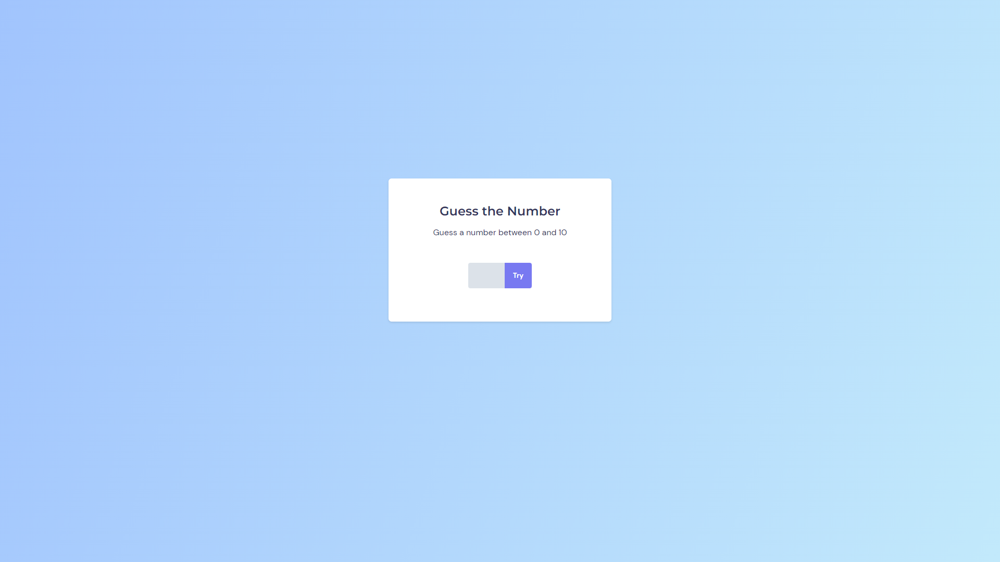
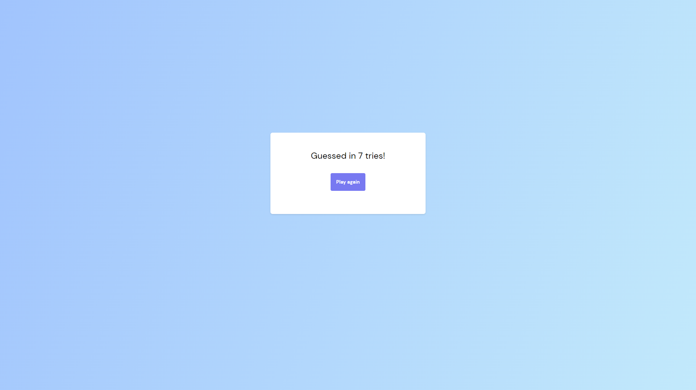

# Guess the Number

## What is this?

A simple **guess game** where the player try to find out a random number. This project was created during a *Rocketseat Explorer* course class and improved through the challenges proposed by the the teacher.
After the player finds the right number, a message appears notifying the number of times the player tried before winning the game and a button is displayed so he can play again:

___

## Technologies used in this project

  

